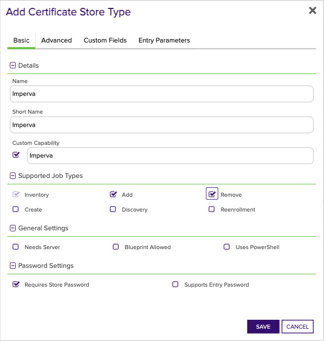

<h1 align="center" style="border-bottom: none">
    Imperva Universal Orchestrator Extension
</h1>

<p align="center">
  <!-- Badges -->

<a href="https://github.com/Keyfactor/imperva-orchestrator/releases"></a>


</p>

<p align="center">
  <!-- TOC -->
  <a href="#support">
    <b>Support</b>
  </a>
  ·
  <a href="#installation">
    <b>Installation</b>
  </a>
  ·
  <a href="#license">
    <b>License</b>
  </a>
  ·
  <a href="https://github.com/orgs/Keyfactor/repositories?q=orchestrator">
    <b>Related Integrations</b>
  </a>
</p>

## Overview


## Compatibility

This integration is compatible with Keyfactor Universal Orchestrator version 10.1 and later.

## Support
The Imperva Universal Orchestrator extension is supported by Keyfactor for Keyfactor customers. If you have a support issue, please open a support ticket with your Keyfactor representative. If you have a support issue, please open a support ticket via the Keyfactor Support Portal at https://support.keyfactor.com. 
 
> To report a problem or suggest a new feature, use the **[Issues](../../issues)** tab. If you want to contribute actual bug fixes or proposed enhancements, use the **[Pull requests](../../pulls)** tab.

## Requirements & Prerequisites

Before installing the Imperva Universal Orchestrator extension, we recommend that you install [kfutil](https://github.com/Keyfactor/kfutil). Kfutil is a command-line tool that simplifies the process of creating store types, installing extensions, and instantiating certificate stores in Keyfactor Command.


The Imperva Orchestrator Extension requires the creation of an Imperva account id, API id, and API key.  Please reference the [Imperva Documentation](Imperva documentation](https://docs.imperva.com/bundle/cloud-application-security/page/settings/api-keys.htm#:~:text=In%20the%20Cloud%20Security%20Console%20top%20menu%20bar%2C%20click%20Account,to%20create%20a%20new%20key) for more information on creating an API id and key for use with this integration.


## Create the Imperva Certificate Store Type

To use the Imperva Universal Orchestrator extension, you **must** create the Imperva Certificate Store Type. This only needs to happen _once_ per Keyfactor Command instance.


* **Create Imperva using kfutil**:

    ```shell
    # Imperva
    kfutil store-types create Imperva
    ```

* **Create Imperva manually in the Command UI**:
    <details><summary>Create Imperva manually in the Command UI</summary>

    Create a store type called `Imperva` with the attributes in the tables below:

    #### Basic Tab
    | Attribute | Value | Description |
    | --------- | ----- | ----- |
    | Name | Imperva | Display name for the store type (may be customized) |
    | Short Name | Imperva | Short display name for the store type |
    | Capability | Imperva | Store type name orchestrator will register with. Check the box to allow entry of value |
    | Supports Add | ✅ Checked | Check the box. Indicates that the Store Type supports Management Add |
    | Supports Remove | ✅ Checked | Check the box. Indicates that the Store Type supports Management Remove |
    | Supports Discovery | 🔲 Unchecked |  Indicates that the Store Type supports Discovery |
    | Supports Reenrollment | 🔲 Unchecked |  Indicates that the Store Type supports Reenrollment |
    | Supports Create | 🔲 Unchecked |  Indicates that the Store Type supports store creation |
    | Needs Server | 🔲 Unchecked | Determines if a target server name is required when creating store |
    | Blueprint Allowed | 🔲 Unchecked | Determines if store type may be included in an Orchestrator blueprint |
    | Uses PowerShell | 🔲 Unchecked | Determines if underlying implementation is PowerShell |
    | Requires Store Password | ✅ Checked | Enables users to optionally specify a store password when defining a Certificate Store. |
    | Supports Entry Password | 🔲 Unchecked | Determines if an individual entry within a store can have a password. |

    The Basic tab should look like this:

    

    #### Advanced Tab
    | Attribute | Value | Description |
    | --------- | ----- | ----- |
    | Supports Custom Alias | Required | Determines if an individual entry within a store can have a custom Alias. |
    | Private Key Handling | Required | This determines if Keyfactor can send the private key associated with a certificate to the store. Required because IIS certificates without private keys would be invalid. |
    | PFX Password Style | Default | 'Default' - PFX password is randomly generated, 'Custom' - PFX password may be specified when the enrollment job is created (Requires the Allow Custom Password application setting to be enabled.) |

    The Advanced tab should look like this:

    

    #### Custom Fields Tab
    Custom fields operate at the certificate store level and are used to control how the orchestrator connects to the remote target server containing the certificate store to be managed. The following custom fields should be added to the store type:

    | Name | Display Name | Description | Type | Default Value/Options | Required |
    | ---- | ------------ | ---- | --------------------- | -------- | ----------- |

    The Custom Fields tab should look like this:

    


    </details>

## Installation

1. **Download the latest Imperva Universal Orchestrator extension from GitHub.** 

    Navigate to the [Imperva Universal Orchestrator extension GitHub version page](https://github.com/Keyfactor/imperva-orchestrator/releases/latest). Refer to the compatibility matrix below to determine whether the `net6.0` or `net8.0` asset should be downloaded. Then, click the corresponding asset to download the zip archive.
    | Universal Orchestrator Version | Latest .NET version installed on the Universal Orchestrator server | `rollForward` condition in `Orchestrator.runtimeconfig.json` | `imperva-orchestrator` .NET version to download |
    | --------- | ----------- | ----------- | ----------- |
    | Older than `11.0.0` | | | `net6.0` |
    | Between `11.0.0` and `11.5.1` (inclusive) | `net6.0` | | `net6.0` | 
    | Between `11.0.0` and `11.5.1` (inclusive) | `net8.0` | `Disable` | `net6.0` | 
    | Between `11.0.0` and `11.5.1` (inclusive) | `net8.0` | `LatestMajor` | `net8.0` | 
    | `11.6` _and_ newer | `net8.0` | | `net8.0` |

    Unzip the archive containing extension assemblies to a known location.

    > **Note** If you don't see an asset with a corresponding .NET version, you should always assume that it was compiled for `net6.0`.

2. **Locate the Universal Orchestrator extensions directory.**

    * **Default on Windows** - `C:\Program Files\Keyfactor\Keyfactor Orchestrator\extensions`
    * **Default on Linux** - `/opt/keyfactor/orchestrator/extensions`
    
3. **Create a new directory for the Imperva Universal Orchestrator extension inside the extensions directory.**
        
    Create a new directory called `imperva-orchestrator`.
    > The directory name does not need to match any names used elsewhere; it just has to be unique within the extensions directory.

4. **Copy the contents of the downloaded and unzipped assemblies from __step 2__ to the `imperva-orchestrator` directory.**

5. **Restart the Universal Orchestrator service.**

    Refer to [Starting/Restarting the Universal Orchestrator service](https://software.keyfactor.com/Core-OnPrem/Current/Content/InstallingAgents/NetCoreOrchestrator/StarttheService.htm).


6. **(optional) PAM Integration** 

    The Imperva Universal Orchestrator extension is compatible with all supported Keyfactor PAM extensions to resolve PAM-eligible secrets. PAM extensions running on Universal Orchestrators enable secure retrieval of secrets from a connected PAM provider.

    To configure a PAM provider, [reference the Keyfactor Integration Catalog](https://keyfactor.github.io/integrations-catalog/content/pam) to select an extension, and follow the associated instructions to install it on the Universal Orchestrator (remote).


> The above installation steps can be supplimented by the [official Command documentation](https://software.keyfactor.com/Core-OnPrem/Current/Content/InstallingAgents/NetCoreOrchestrator/CustomExtensions.htm?Highlight=extensions).


## Defining Certificate Stores


* **Manually with the Command UI**

    <details><summary>Create Certificate Stores manually in the UI</summary>

    1. **Navigate to the _Certificate Stores_ page in Keyfactor Command.**

        Log into Keyfactor Command, toggle the _Locations_ dropdown, and click _Certificate Stores_.

    2. **Add a Certificate Store.**

        Click the Add button to add a new Certificate Store. Use the table below to populate the **Attributes** in the **Add** form.
        | Attribute | Description |
        | --------- | ----------- |
        | Category | Select "Imperva" or the customized certificate store name from the previous step. |
        | Container | Optional container to associate certificate store with. |
        | Client Machine |  |
        | Store Path |  |
        | Orchestrator | Select an approved orchestrator capable of managing `Imperva` certificates. Specifically, one with the `Imperva` capability. |
        | Store Password | Your Imperva API id and API key concatenated with a comma (,}.  For example: 12345,12345678-1234-1234-1234-123456789ABC.  Please refer to the [Imperva documentation](https://docs.imperva.com/bundle/cloud-application-security/page/settings/api-keys.htm#:~:text=In%20the%20Cloud%20Security%20Console%20top%20menu%20bar%2C%20click%20Account,to%20create%20a%20new%20key.) as to how to create an API id and key. |

        

        <details><summary>Attributes eligible for retrieval by a PAM Provider on the Universal Orchestrator</summary>

        If a PAM provider was installed _on the Universal Orchestrator_ in the [Installation](#Installation) section, the following parameters can be configured for retrieval _on the Universal Orchestrator_.
        | Attribute | Description |
        | --------- | ----------- |
        | Store Password | Your Imperva API id and API key concatenated with a comma (,}.  For example: 12345,12345678-1234-1234-1234-123456789ABC.  Please refer to the [Imperva documentation](https://docs.imperva.com/bundle/cloud-application-security/page/settings/api-keys.htm#:~:text=In%20the%20Cloud%20Security%20Console%20top%20menu%20bar%2C%20click%20Account,to%20create%20a%20new%20key.) as to how to create an API id and key. |

        Please refer to the **Universal Orchestrator (remote)** usage section ([PAM providers on the Keyfactor Integration Catalog](https://keyfactor.github.io/integrations-catalog/content/pam)) for your selected PAM provider for instructions on how to load attributes orchestrator-side.

        > Any secret can be rendered by a PAM provider _installed on the Keyfactor Command server_. The above parameters are specific to attributes that can be fetched by an installed PAM provider running on the Universal Orchestrator server itself. 
        </details>
        

    </details>

* **Using kfutil**
    
    <details><summary>Create Certificate Stores with kfutil</summary>
    
    1. **Generate a CSV template for the Imperva certificate store**

        ```shell
        kfutil stores import generate-template --store-type-name Imperva --outpath Imperva.csv
        ```
    2. **Populate the generated CSV file**

        Open the CSV file, and reference the table below to populate parameters for each **Attribute**.
        | Attribute | Description |
        | --------- | ----------- |
        | Category | Select "Imperva" or the customized certificate store name from the previous step. |
        | Container | Optional container to associate certificate store with. |
        | Client Machine |  |
        | Store Path |  |
        | Orchestrator | Select an approved orchestrator capable of managing `Imperva` certificates. Specifically, one with the `Imperva` capability. |
        | Store Password | Your Imperva API id and API key concatenated with a comma (,}.  For example: 12345,12345678-1234-1234-1234-123456789ABC.  Please refer to the [Imperva documentation](https://docs.imperva.com/bundle/cloud-application-security/page/settings/api-keys.htm#:~:text=In%20the%20Cloud%20Security%20Console%20top%20menu%20bar%2C%20click%20Account,to%20create%20a%20new%20key.) as to how to create an API id and key. |

        

        <details><summary>Attributes eligible for retrieval by a PAM Provider on the Universal Orchestrator</summary>

        If a PAM provider was installed _on the Universal Orchestrator_ in the [Installation](#Installation) section, the following parameters can be configured for retrieval _on the Universal Orchestrator_.
        | Attribute | Description |
        | --------- | ----------- |
        | Store Password | Your Imperva API id and API key concatenated with a comma (,}.  For example: 12345,12345678-1234-1234-1234-123456789ABC.  Please refer to the [Imperva documentation](https://docs.imperva.com/bundle/cloud-application-security/page/settings/api-keys.htm#:~:text=In%20the%20Cloud%20Security%20Console%20top%20menu%20bar%2C%20click%20Account,to%20create%20a%20new%20key.) as to how to create an API id and key. |

        > Any secret can be rendered by a PAM provider _installed on the Keyfactor Command server_. The above parameters are specific to attributes that can be fetched by an installed PAM provider running on the Universal Orchestrator server itself. 
        </details>
        

    3. **Import the CSV file to create the certificate stores** 

        ```shell
        kfutil stores import csv --store-type-name Imperva --file Imperva.csv
        ```
    </details>

> The content in this section can be supplimented by the [official Command documentation](https://software.keyfactor.com/Core-OnPrem/Current/Content/ReferenceGuide/Certificate%20Stores.htm?Highlight=certificate%20store).


## License

Apache License 2.0, see [LICENSE](LICENSE).

## Related Integrations

See all [Keyfactor Universal Orchestrator extensions](https://github.com/orgs/Keyfactor/repositories?q=orchestrator).