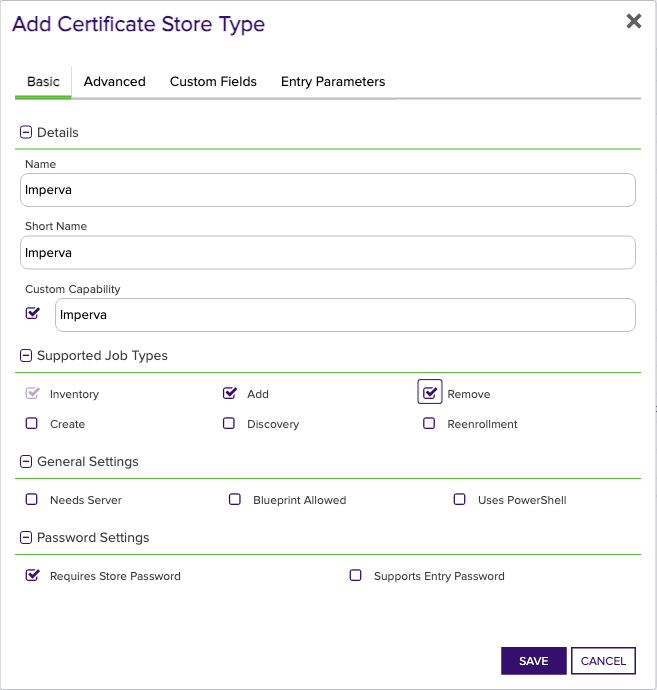
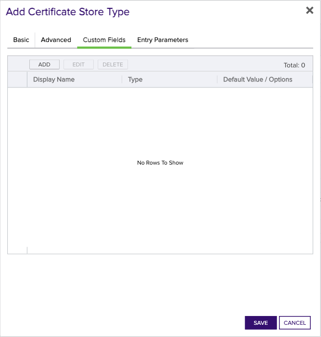

## Imperva

The Imperva Certificate Store Type in Keyfactor Command allows for the management of certificates within the Imperva platform. This Certificate Store Type represents a specific repository where Imperva certificates are stored, accessed through an API using appropriate account credentials.

### Functionality
The primary function of the Imperva Certificate Store Type is to facilitate the inventory, addition, and removal of certificates within the Imperva system. By defining this store type, users can ensure that Keyfactor Command is able to interact directly with the Imperva environment to manage certificate lifecycles efficiently.

### Representation
In Keyfactor Command, the Imperva Certificate Store Type represents an Imperva account, accessible through a provided URL and secured by an API ID and key. This configuration recognizes the account as a Certificate Store, enabling Keyfactor Command to perform necessary certificate management operations.

### Caveats and Limitations
- **Custom Capability**: Users must ensure the 'Custom Capability' checkbox is unchecked during setup, as custom capabilities are not required for this store type.
- **Password Handling**: It is important to note that the `Store Password` necessitates the Imperva API ID and key concatenated with a comma.
- **Blueprint Allowed**: While blueprinting is supported, users should consult the Keyfactor Command documentation for detailed information on this feature.
- **Entry Password**: The Imperva Certificate Store Type does not support entry passwords.

While no specific SDK is mentioned for integration, users must carefully follow the provided setup instructions to avoid misconfigurations. Any deviation from the prescribed settings, such as not unchecking 'Custom Capability' or incorrect API credentials, can lead to operational issues.


### Supported Job Types

| Job Name | Supported |
| -------- | --------- |
| Inventory | ✅ |
| Management Add | ✅ |
| Management Remove | ✅ |
| Discovery |  |
| Create |  |
| Reenrollment |  |

## Requirements

### Imperva Orchestrator Extension Installation
1. Create the Imperva certificate store type manually in Keyfactor Command by clicking on Settings (the gear icon on the top right) => Certificate Store Types => Add and then entering the settings described in the next section - Certificate Store Type Settings, OR by utilizing the CURL script found under the Certificate Store Type CURL Script folder in this repo. 
2. Stop the Keyfactor Universal Orchestrator Service for the orchestrator you plan to install this extension to run on.
3. In the Keyfactor Orchestrator installation folder (by convention usually C:\Program Files\Keyfactor\Keyfactor Orchestrator), find the "Extensions" folder. Underneath that, create a new folder named "Imperva" (you may choose to use a different name if you wish).
4. Download the latest version of the Imperva Orchestrator Extension from [GitHub](https://github.com/Keyfactor/imperva-orchestrator).  Click on the "Latest" release link on the right hand side of the main page and download the first zip file.
5. Copy the contents of the download installation zip file to the folder created in Step 3.
6. (Optional) If you decide to create the certificate store type with a short name different than the suggested value of "Imperva", edit the manifest.json file in the folder you created in step 3, and modify each "ShortName" in each "Certstores.{ShortName}.{Operation}" line with the ShortName you used to create the certificate store type in Keyfactor Command.  If you created it with the suggested value, this step can be skipped.
7. Start the Keyfactor Universal Orchestrator Service.
8. In Keyfactor Command, go to Orchestrators => Management and approve the Keyfactor Orchestrator containing the Imperva capability that you just installed by selecting the orchestrator and clicking APPROVE.
&nbsp;  
&nbsp;

### Certificate Store Type Settings
Below are the values you need to enter if you choose to manually create the Imperva certificate store type in the Keyfactor Command UI (related to Step 1 of Imperva Orchestrator Extension Installation above).  

*Basic Tab:*
- **Name** – Required. The display name you wish to use for the new certificate store type.  Suggested value - Imperva
- **ShortName** - Required. Suggested value - Imperva.  If you choose to use a different value, please refer to Step 6 under Imperva Orchestrator Extension Installation above.
- **Custom Capability** - Unchecked
- **Supported Job Types** - Inventory, Add, and Remove should all be checked.
- **Needs Server** - Unchecked
- **Blueprint Allowed** - Checked if you wish to make use of blueprinting.  Please refer to the Keyfactor Command Reference Guide for more details on this feature.
- **Uses PoserShell** - Unchecked
- **Requires Store Password** - Checked.
- **Supports Entry Password** - Unchecked.  

*Advanced Tab:*  
- **Store Path Type** - Freeform
- **Supports Custom Alias** - Required
- **Private Key Handling** - Required
- **PFX Password Style** - Default  

*Custom Fields Tab:*
None

*Entry Parameters:*
None
&nbsp;  
&nbsp;

### Creating an Imperva Certificate Store in Keyfactor Command
To create a Keyfactor Command certificate store of certificate store type Imperva, go to Locations => Certificate Stores and click ADD.  Then enter the following:  
- Category - Imperva (or the alternate ShortName value you entered when creating your certificate store type).
- Container - Optional.  Refer to Keyfactor Command documentation about this feature.
- Client Machine - The URL that will be used as the base URL for Imperva endpoint calls.  Should be https://my.imperva.com
- Store Path - Your Imperva account id.  Please refer to the [Imperva documentation](https://docs.imperva.com/howto/bd68301b) as to how to find your Imperva account id.
- Store Password - Your Imperva API id and API key concatenated with a comma (,}.  For example: 12345,12345678-1234-1234-1234-123456789ABC.  Please refer to the [Imperva documentation](https://docs.imperva.com/bundle/cloud-application-security/page/settings/api-keys.htm#:~:text=In%20the%20Cloud%20Security%20Console%20top%20menu%20bar%2C%20click%20Account,to%20create%20a%20new%20key.) as to how to create an API id and key.


## Certificate Store Type Configuration

The recommended method for creating the `Imperva` Certificate Store Type is to use [kfutil](https://github.com/Keyfactor/kfutil). After installing, use the following command to create the `` Certificate Store Type:

```shell
kfutil store-types create Imperva
```

<details><summary>Imperva</summary>

Create a store type called `Imperva` with the attributes in the tables below:

### Basic Tab
| Attribute | Value | Description |
| --------- | ----- | ----- |
| Name | Imperva | Display name for the store type (may be customized) |
| Short Name | Imperva | Short display name for the store type |
| Capability | Imperva | Store type name orchestrator will register with. Check the box to allow entry of value |
| Supported Job Types (check the box for each) | Add, Discovery, Remove | Job types the extension supports |
| Supports Add | ✅ | Check the box. Indicates that the Store Type supports Management Add |
| Supports Remove | ✅ | Check the box. Indicates that the Store Type supports Management Remove |
| Supports Discovery |  |  Indicates that the Store Type supports Discovery |
| Supports Reenrollment |  |  Indicates that the Store Type supports Reenrollment |
| Supports Create |  |  Indicates that the Store Type supports store creation |
| Needs Server |  | Determines if a target server name is required when creating store |
| Blueprint Allowed |  | Determines if store type may be included in an Orchestrator blueprint |
| Uses PowerShell |  | Determines if underlying implementation is PowerShell |
| Requires Store Password | ✅ | Determines if a store password is required when configuring an individual store. |
| Supports Entry Password |  | Determines if an individual entry within a store can have a password. |

The Basic tab should look like this:



### Advanced Tab
| Attribute | Value | Description |
| --------- | ----- | ----- |
| Supports Custom Alias | Required | Determines if an individual entry within a store can have a custom Alias. |
| Private Key Handling | Required | This determines if Keyfactor can send the private key associated with a certificate to the store. Required because IIS certificates without private keys would be invalid. |
| PFX Password Style | Default | 'Default' - PFX password is randomly generated, 'Custom' - PFX password may be specified when the enrollment job is created (Requires the Allow Custom Password application setting to be enabled.) |

The Advanced tab should look like this:


### Custom Fields Tab
Custom fields operate at the certificate store level and are used to control how the orchestrator connects to the remote target server containing the certificate store to be managed. The following custom fields should be added to the store type:

| Name | Display Name | Type | Default Value/Options | Required | Description |
| ---- | ------------ | ---- | --------------------- | -------- | ----------- |


The Custom Fields tab should look like this:




</details>

## Certificate Store Configuration

After creating the `Imperva` Certificate Store Type and installing the Imperva Universal Orchestrator extension, you can create new [Certificate Stores](https://software.keyfactor.com/Core-OnPrem/Current/Content/ReferenceGuide/Certificate%20Stores.htm?Highlight=certificate%20store) to manage certificates in the remote platform.

The following table describes the required and optional fields for the `Imperva` certificate store type.

| Attribute | Description | Attribute is PAM Eligible |
| --------- | ----------- | ------------------------- |
| Category | Select "Imperva" or the customized certificate store name from the previous step. | |
| Container | Optional container to associate certificate store with. | |
| Client Machine | For the Client Machine field, enter the base URL for your Imperva endpoint calls, such as https://my.imperva.com. | |
| Store Path | For the Store Path field, enter your Imperva account ID. Refer to the Imperva documentation on how to locate your account ID. | |
| Orchestrator | Select an approved orchestrator capable of managing `Imperva` certificates. Specifically, one with the `Imperva` capability. | |

* **Using kfutil**

    ```shell
    # Generate a CSV template for the AzureApp certificate store
    kfutil stores import generate-template --store-type-name Imperva --outpath Imperva.csv

    # Open the CSV file and fill in the required fields for each certificate store.

    # Import the CSV file to create the certificate stores
    kfutil stores import csv --store-type-name Imperva --file Imperva.csv
    ```

* **Manually with the Command UI**: In Keyfactor Command, navigate to Certificate Stores from the Locations Menu. Click the Add button to create a new Certificate Store using the attributes in the table above.